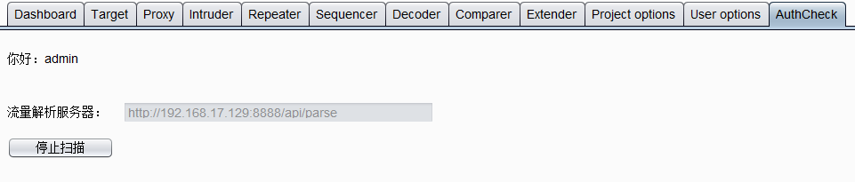
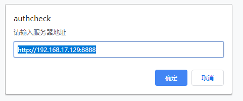
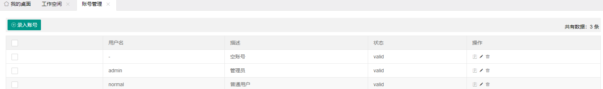
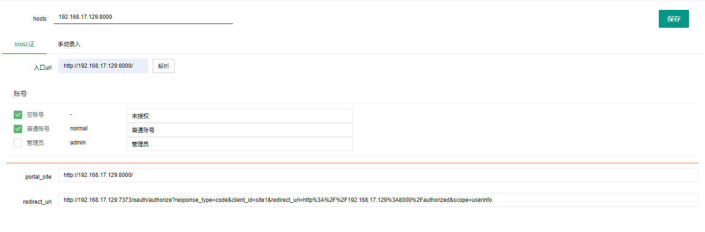
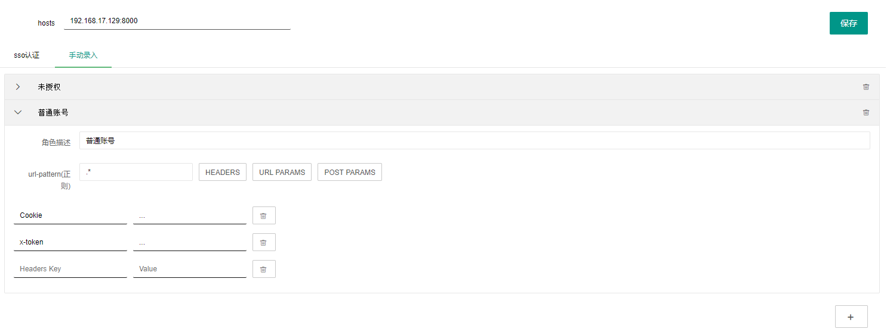
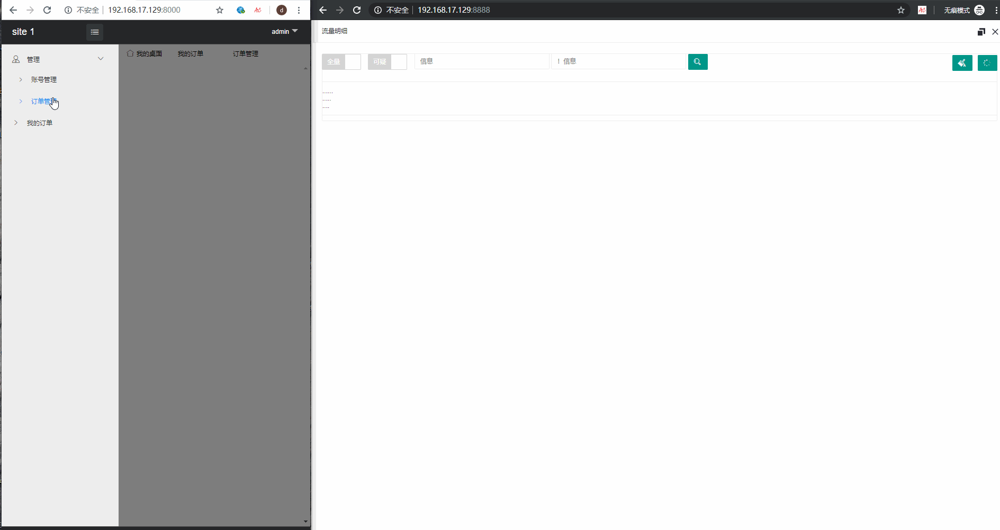

# 越权检测工具

[项目介绍]()

# 快速开始

## 部署

### 越权检测工具

- 启动服务

```bash
cd authcheck
docker-compose up -d
```

- 启动示例站点

```bash
cd example
# 需要将 docker-compose.yml 中的 your-ip 替换为当前机器的ip，以便访问
docker-compose up -d
```

### 流量捕获

可通过burp插件、浏览器插件、代理服务器等方式向越权检测服务器传输流量

traffic文件中包含了burp插件和chrome扩展两个示例

1. burp插件

    加载后，输入越权检测服务器的地址，在浏览器中打开任意页面登陆后，点击开始扫描即可

    

2. chrome扩展

    加载后，输入越权检测服务器的地址，打开任意页面，登录即可

    

## 使用

### 登录

目前工具内置的两个账号，如下：(默认端口8888)

- 管理员
  
    admin: admin123
- 普通用户
  
    normal: normal123

正式使用时可接入自己公司内部的认证体系，以便标识使用者身份

examples中带了两个示例站点（默认端口8000、8001）和一个sso认证站点（默认端口 7373）

- 管理员
  
    admin: admin123
    
- 普通用户
  
    normal: normal123

在使用时，如果发现登陆了examples中的站点会导致越权检测工具的登陆状态失效，可考虑使用隐私窗口打开待测站点

### 预配置

工具支持两种类型系统的检测，sso认证和手动录入认证信息，sso认证以examples下的站点作为演示，如果要适配自己公司内部的sso，可修改相关认证逻辑

- 录入账号

    先录入一些账号信息以便自动登陆sso，这里简单的录入账号密码作为演示（若要录入空账号，可将用户名设置为 - ）
    
    

- 工作空间

    在测试前，需要为待测站点创建一个工作空间，创建后根据要测试的系统来选择不同的认证逻辑。对于接入统一认证的系统，只需要输入首页url后点击解析按钮，并选择要使用的账号即可
    
    
    
    当然，自动认证的逻辑还是要自己实现，这里只是用examples中的站点做个示例
    
    对于一些不方便实现自动认证的系统，可以选择手动录入认证信息
    
    

### 越权漏洞检测

流程如下，burp插件/chrome扩展 会将流量实时发送至越权检测服务器中，测试人员可在流量明细界面实时监听

扫描的请求会对完全相同的请求进行去重，点击右上角的清空按钮后，可将工作空间内的流量清空，同时去重规则也会清空。如果需要再查看已被清空的流量的话，可选中左上角的“全量”按钮

测试中的可能存在问题的请求会高亮标识，选中左上角的”可疑“按钮，将会只查看可能存在的请求

上方的表单可以进行一定的筛选，筛选规则为 包含/不包含 ，若有多个，可以 `|` 进行分隔

每个请求包上都会有两个按钮，屏蔽和重放。点击屏蔽，可在上方的表单中添加对应的屏蔽规则，在重新查询或者监听时，不会再展示在屏蔽规则内的流量（只是不展示了，实际还存在的）。点击重放按钮，即可对该条请求进行重放，这在复测的时候比较好用

同时每次打开流量明细的窗口时，都会刷新对应工作空间的session信息（手动录入认证信息的工作空间不会刷新）

### 操作示意



# 开发指南

若系统没有接入统一认证或无法大批量实现自动认证，可直接部署好后，为每个工作空间手动录入认证信息

若可以实现待测系统的自动认证，可参考下面的内容来定制化工具

## 代码结构

```bash
authcheck/
├── app
│   ├── common
│   │   ├── decorators.py             # 装饰器
│   │   ├── func.py                   # 模板中用到的一些函数
│   │   ├── __init__.py
│   │   └── util.py                   # 辅助工具
│   ├── conf
│   │   ├── conf.py                   # 一些常规配置
│   │   ├── __init__.py
│   │   └── secret.py                 # 密钥、数据库等配置信息
│   ├── core
│   │   ├── flow.py                   # 站点解析
│   │   ├── identify                  # 不同系统类型的工作空间认证流程
│   │   │   ├── direct.py                 # 直接录入认证信息
│   │   │   ├── __init__.py
│   │   │   └── sso.py                    # 接入统一认证的系统（示例）
│   │   ├── __init__.py
│   │   ├── jobs.py                   # 定时任务
│   │   └── lib.py                    # 其他函数
│   ├── __init__.py
│   ├── model
│   │   ├── exception.py              # 异常类定义
│   │   ├── __init__.py
│   │   ├── model.py                  # 一些简单的model
│   │   └── po.py                     # 数据库model
│   ├── static
│   ├── templates
│   └── web
│       ├── api.py                    # 开放的api
│       ├── error.py                  # 异常处理
│       ├── __init__.py
│       ├── web.py                    # web页面
│       └── ws.py                     # 流量监听
├── docker-compose.yml
├── Dockerfile
├── favicon.ico
├── README.md
├── requirements.txt
├── uwsgi.ini
└── wsgi.py
```

## 主要改写流程

- 确定自动认证的流程需要哪些信息，并在 `app/model/po.py` 中添加相应的模型
- `app/templates/` 下修改页面

- `app/lib/identify` 下添加自己的认证流程，配置等

目前工具中放入了一个简单的自动认证sso的示例，可参考修改

